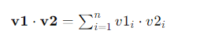
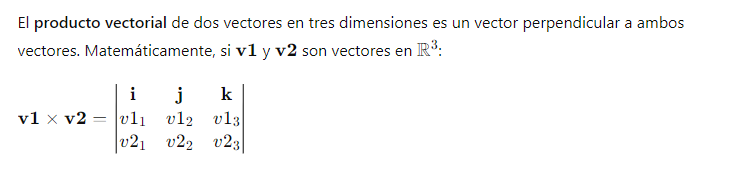
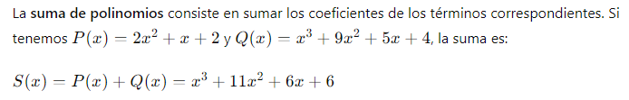
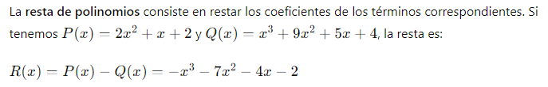
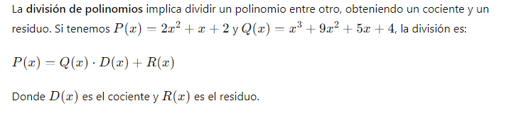
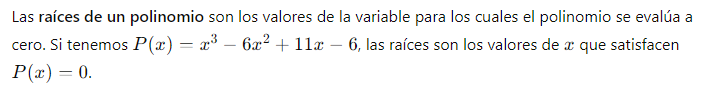
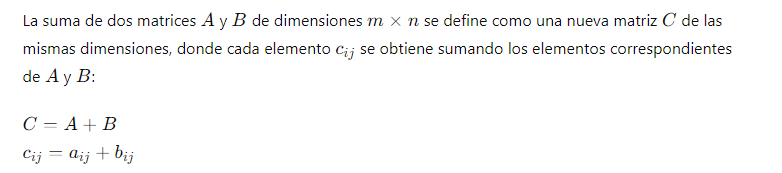
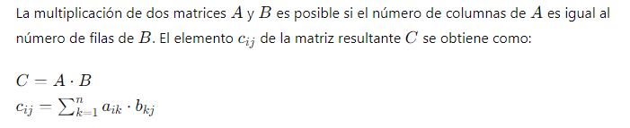
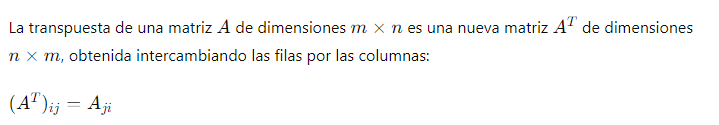
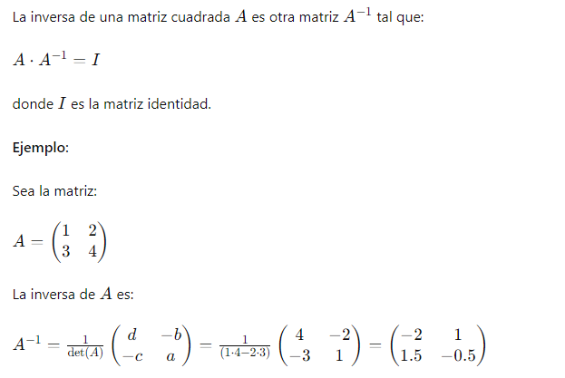

# INFORMACIÓN GENERAL
# UNIVERSIDAD NACIONAL DE SAN ANTONIO ABAD DEL CUSCO

## ESCUELA PROFESIONAL DE INGENIERÍA INFORMÁTICA Y DE SISTEMAS

* ABSTRACCIÓN DE DATOS Y OBJETOS

**Proyecto de investigación formativa**

 - profesora: **Mgt. Nila Zonia Acurio Usca**
 - Alumno: **Efrain Vitorino Marin** cod: **160337**
 # Tema: Introducción a Numpy
   
- **La clase de objetos array**
Un array es una estructura de datos de un mismo tipo organizada en forma de tabla o cuadrícula de distintas dimensiones.Las dimensiones de un array también se conocen como ejes. 
- **Creación de arrays**

    Para crear un array se utiliza la siguiente función de NumPy

 - `np.array(lista)` : Crea un array a partir de la lista o tupla lista y devuelve una referencia a él. El número de dimensiones del array dependerá de las listas o tuplas anidadas en lista:

- Para una lista de valores se crea un array de una dimensión, también conocido como **vector**.

- Para una lista de listas de valores se crea un array de dos dimensiones, también conocido como **matriz**.

- Para una lista de listas de listas de valores se crea un array de tres dimensiones, también conocido como **cubo**.

- Y así sucesivamente. **No hay límite en el número de dimensiones del array** más allá de la memoria disponible en el sistema.
## Utilizacion e importacion 
- NumPy es una librería (paquete) de Python, que porporciona funcionalidades  especializadas en el cálculo numérico y el análisis de datos. significa "Numerical Python".
Contiene objetos denominados arreglos (Array), que permiten almacenar colecciones de datos homogéneos, proporcionando funciones muy eficientes para procesar grandes volúmenes de datos.
Incorpora una nueva clase de objetos llamados arrays que permite representar colecciones de datos de un mismo tipo en varias dimensiones, con funciones muy eficientes para su manipulación.
NumPy es la librería base utilizada ampliamente en la computación científica, principalmente en Inteligencia Artificial.
```python
# -- Importar la librería numpy
import numpy as np
```
## Arreglos unidimensionales
- un arreglo unidimensional se puede definir como una función que asigna un número entero dentro de un rango específico a cada elemento del arreglo. Formalmente, si tenemos un arreglo A de longitud 𝑛, podemos definirlo como:
  - `A:{0,1,2,…,n−1}→T ` donde: `{0,1,2,…,n−1}` es el conjunto de índices del arreglo.
  - ``𝑇`` es el tipo de los elementos almacenados en el arreglo (por ejemplo, números enteros, flotantes, caracteres, etc.). ``𝐴(𝑖)`` representa el elemento el arreglo en la posición 𝑖.
  Ejemplo Si 
``𝐴`` es un arreglo de enteros con 𝑛=5, podríamos tener:
``𝐴=[2,4,6,8,10]``
Aquí, `𝐴(0)=2, 𝐴(1)=4, 𝐴(2)=6, 𝐴(3)=8, y 𝐴(4)=10`.
En resumen, un arreglo unidimensional es una estructura ordenada y contigua de elementos del mismo tipo, accesible mediante índices que normalmente comienzan desde ``0``.

- ### Suma de Vectores
  - La suma de vectores consiste en sumar los elementos correspondientes de dos vectores para obtener un nuevo vector. Matemáticamente, si tenemos dos vectores ``𝑣1 y 𝑣2``, su suma es:``𝑣=𝑣1+𝑣2``
   - ejemplo en python 
   ```python 
   # Definir dos vectores
   v1 = np.array([0, 1, 1])
   v2 = np.array([2, 2, 0])
   # Sumar los dos vectores
   s = v1 + v2
  print(s)  # Salida: [2 3 1] 
   ```
- ###  Producto Escalar de Vectores
  - El producto escalar (o punto) de dos vectores es una operación que toma dos secuencias de números (vectores) y devuelve un solo número. Matemáticamente, para dos vectores 𝑣1 y 𝑣2:
  
  * Ejemplo python 
  ```python
  # Definir dos vectores
  v1 = np.array([0, 1, 1])
  v2 = np.array([2, 2, 1])

  #  Efectuar el producto punto de los vectores
  p = np.dot(v1, v2)
  print(p)  # Salida: 3
  ```
- ### Producto Vectorial de Vectores
  - 
  - Ejemplo python 
  ```python
  # Definir dos vectores
  v1 = np.array([3, 1, 1])
  v2 = np.array([2, 2, 2])

  # Efectuar el producto vectorial de los vectores
  p = np.cross(v1, v2)
  print(p)  # Salida: [ 0 -4  4]
  ```
- ## Polinomios
  - NumPy proporciona herramientas para trabajar con polinomios mediante la clase `numpy.poly1d`. Esta clase permite definir, sumar, restar, multiplicar, dividir y encontrar las raíces de los polinomios.
Para trabajar con polinomios en NumPy, **primero se importa la biblioteca:**  ``import numpy as np``
  - ejemplo 
  ```python
  import numpy as np
  # Definir el primer polinomio P(x) = 2x^2 + x + 2
  p = np.poly1d([2, 1, 2])
  # Definir el segundo polinomio Q(x) = x^3 + 9x^2 + 5x + 4
  q = np.poly1d([1, 9, 5, 4])
  print("Primer polinomio:")
  print(p)
  print("\nSegundo polinomio:")
  print(q)
  ```
  - **salida**
  ```python
  Primer polinomio:
   2
  2 x + 1 x + 2
  Segundo polinomio:
   3     2
  1 x + 9 x + 5 x + 4
  ```
- ### Suma de Polinomios
  - 
   - ```python
      # Sumar los polinomios
      s = np.polyadd(p, q)
      print("\n Suma de los polinomios:")
      print(s)
     ```
    - **Salida**
      ```python
      Suma de los polinomios:
         3      2
       1 x + 11 x + 6 x + 6
      ````
- ### Resta de Polinomios
  * 
  * ```python
    # Restar los polinomios
    r = np.polysub(p, q)
    print("\nResta de los polinomios:")
    print(r)
    ```
  * **salida**
    ```python
     Resta de los polinomios:
     3   2
     -1 x - 7 x - 4 x - 2
     ```
- ### División de Polinomios
  * 
    ```python
      # Dividir los polinomios
      d, r = np.polydiv(p, q)
      print("\n División de los polinomios:")
      print("Cociente:")
      print(d)
      print("Resto:")
      print(r)
      ```
     **salida**
     ```python 
        División de los polinomios:
        Cociente: 0
        Resto:  2
        2 x + 1 x + 2
      ```
- ### Raíces de un Polinomio
    - 
      ```python 
      # Definir un polinomio
      p = np.poly1d([1, -6, 11, -6])
      print("Polinomio:")
      print(p)
      # Calcular las raíces del polinomio
      roots = np.roots(p)
      print("\nRaíces del polinomio:")
      print(roots)
      ```
    **salida**
    - ```python
      Polinomio:
        3     2
      1 x - 6 x + 11 x - 6
      Raíces del polinomio:
      [3. 2. 1.]
      ```

      
- ## Arreglos Bidimensionales
   * Un arreglo bidimensional (también conocido como matriz) es una estructura de datos que consiste en una colección de elementos organizados en filas y columnas. Cada elemento puede ser identificado por dos índices: uno que representa la fila y otro que representa la columna. ``np.array([])``
   - **Operacion con matrices**
   - ## suma 
   - 
      ```python
      import numpy as np
      A = np.array([[1, 2, 3], [4, 5, 6]])
      B = np.array([[7, 8, 9], [10, 11, 12]])
      C = np.add(A, B)
      print("Suma de matrices:\n", C)
     ```
  - ## Multiplicación de Matrices
      uso de ``np.dot``
     
     ```python
     A = np.array([[1, 2], [3, 4]])
     B = np.array([[5, 6], [7, 8]])
     C = np.dot(A, B)
     print("Multiplicación de matrices:\n", C)
     ```
   - ## Transpuesta de una Matriz
      
     uso de ``np.transpose``
     ```python
     A = np.array([[1, 2, 3], [4, 5, 6]])
     AT = np.transpose(A)
     print("Transpuesta de la matriz:\n", AT)
     ```
    - ## Inversa de una Matriz
      
      uso de ``np.linalg.inv``
      ```python
      A = np.array([[1, 2], [3, 4]])
      A_inv = np.linalg.inv(A)
      print("Inversa de la matriz:\n", A_inv)
      ```
##  Aplicación: Regresión Lineal Múltiple
  - **Introducción a la Regresión Lineal Múltiple:**
    La regresión lineal múltiple es una extensión de la regresión lineal simple, que se utiliza cuando tenemos más de una variable independiente que afecta a la variable dependiente.
    * Fórmula general: ``𝑌=𝛽0+𝛽1𝑋+𝛽2𝑋2+…+𝛽𝑛𝑋𝑛+𝜖``
    * ``𝑌`` es la variable dependiente.
    * ``𝑋1,𝑋2,...,𝑋𝑛``  son las variables independientes.
    * ``𝛽0``  es el término constante.
    * ``𝛽1,𝛽2,...,𝛽𝑛`` son los coeficientes de las variables independientes.
    * ``𝜖`` es el término de error.
    # Ejemplo de aplicacion 
    Una empresa de chocolates en la ciudad de Cusco desea optimizar sus campañas de marketing para maximizar las ventas de sus productos. La empresa ha realizado diversas inversiones en publicidad en redes sociales, televisión y radio, además de realizar ventas tanto a través de entregas a domicilio como en tiendas físicas.
    ---
    * predecir las ventas futuras de chocolates en Cusco basándose en los datos históricos de ventas y gastos en campañas de marketing. Adicionalmente, se quiere calcular el presupuesto total de marketing y determinar qué porcentaje representa dicho presupuesto respecto a las ventas proyectadas.

