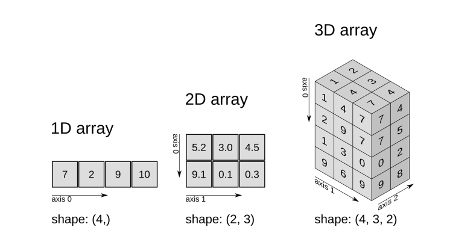

# INFORMACIÓN GENERAL
# UNIVERSIDAD NACIONAL DE SAN ANTONIO ABAD DEL CUSCO

## ESCUELA PROFESIONAL DE INGENIERÍA INFORMÁTICA Y DE SISTEMAS

* ABSTRACCIÓN DE DATOS Y OBJETOS

**Proyecto de investigación formativa**

 - profesora: **Mgt. Nila Zonia Acurio Usca**
 - Alumno: **Efrain Vitorino Marin** cod: **160337**
 # Tema: Introducción a Numpy
   
- **La clase de objetos array**
Un array es una estructura de datos de un mismo tipo organizada en forma de tabla o cuadrícula de distintas dimensiones.Las dimensiones de un array también se conocen como ejes. 
- **Creación de arrays**

    Para crear un array se utiliza la siguiente función de NumPy

 - `np.array(lista)` : Crea un array a partir de la lista o tupla lista y devuelve una referencia a él. El número de dimensiones del array dependerá de las listas o tuplas anidadas en lista:

- Para una lista de valores se crea un array de una dimensión, también conocido como **vector**.

- Para una lista de listas de valores se crea un array de dos dimensiones, también conocido como **matriz**.

- Para una lista de listas de listas de valores se crea un array de tres dimensiones, también conocido como **cubo**.

- Y así sucesivamente. **No hay límite en el número de dimensiones del array** más allá de la memoria disponible en el sistema.
## Utilizacion e importacion 
- NumPy es una librería (paquete) de Python, que porporciona funcionalidades  especializadas en el cálculo numérico y el análisis de datos. significa "Numerical Python".
Contiene objetos denominados arreglos (Array), que permiten almacenar colecciones de datos homogéneos, proporcionando funciones muy eficientes para procesar grandes volúmenes de datos.
Incorpora una nueva clase de objetos llamados arrays que permite representar colecciones de datos de un mismo tipo en varias dimensiones, con funciones muy eficientes para su manipulación.
NumPy es la librería base utilizada ampliamente en la computación científica, principalmente en Inteligencia Artificial.
```python
# -- Importar la librería numpy
import numpy as np
```
## Arreglos unidimensionales
- un arreglo unidimensional se puede definir como una función que asigna un número entero dentro de un rango específico a cada elemento del arreglo. Formalmente, si tenemos un arreglo A de longitud 𝑛, podemos definirlo como:
  - `A:{0,1,2,…,n−1}→T ` donde: `{0,1,2,…,n−1}` es el conjunto de índices del arreglo.
  - 𝑇 es el tipo de los elementos almacenados en el arreglo (por ejemplo, números enteros, flotantes, caracteres, etc.). 𝐴(𝑖) representa el elemento el arreglo en la posición 𝑖.
  Ejemplo Si 
𝐴 es un arreglo de enteros con 𝑛=5, podríamos tener:
𝐴=[2,4,6,8,10]
Aquí, `𝐴(0)=2, 𝐴(1)=4, 𝐴(2)=6, 𝐴(3)=8, y 𝐴(4)=10`.
En resumen, un arreglo unidimensional es una estructura ordenada y contigua de elementos del mismo tipo, accesible mediante índices que normalmente comienzan desde 0.