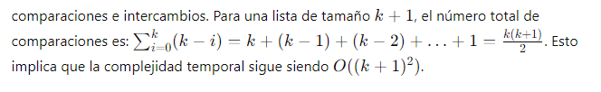
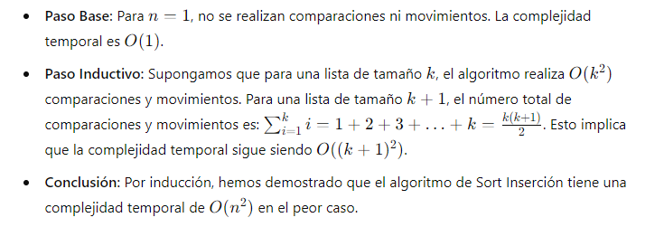
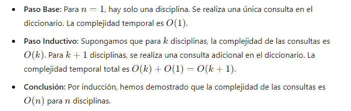
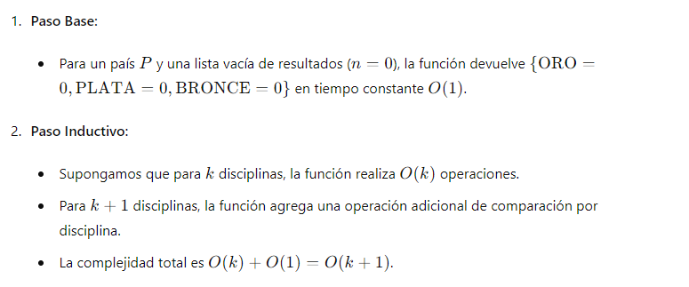
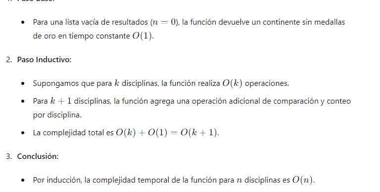

# Documentacion del Ejersicio
## Tarea de Listas y Diccionario
## **Nombre:** Efrain Vitorino Marin **Cod:** 160337
---
### Objetivo
- gestión de datos específicos de las Olimpiadas. Se incluyen dos algoritmos de ordenación (Intercambio y Inserción) y funciones para gestionar y consultar datos relacionados con las Olimpiadas, como contar las medallas obtenidas por países y determinar el continente con más medallas de oro.
### Algoritmo Iterativo Sort Intercambio
-  ordenar una lista de números utilizando el algoritmo de intercambio directo. La función compara todos los pares posibles de elementos y los intercambia si están en el orden incorrecto.
 
      - **Fundamento Matemático**
      •  **Paso Base:**  Para `n=1`, no se realizan comparaciones ni intercambios. La complejidad temporal es   `O(1)`.
      •  **Paso Inductivo:** Supongamos que para una lista de tamaño `k`, el algoritmo realiza `O*(k^2)` comparaciones e intercambios. Para una lista de tamaño k+1k+1k+1, el número total de comparaciones es: 
      
      
    •  **Conclusión:** Por inducción, hemos demostrado que el algoritmo de Sort Intercambio tiene una complejidad temporal de `O(n^2)`.
### Codigo en python 
```python
# --- Implementar Sort Intercambio
def SortIntercambio(arr):
    n = len(arr)  # Obtiene la longitud de la lista
    
    for i in range(n):  # Primer bucle que recorre todos los elementos de la lista
        for j in range(i + 1, n):  # Segundo bucle que recorre los elementos restantes
            if arr[i] > arr[j]:  # Si el elemento actual es mayor que el siguiente, intercambiarlos
                arr[i], arr[j] = arr[j], arr[i]  # Intercambio de elementos
    
    return arr  # Devuelve la lista ordenada

# Ejemplo de uso:
lista = [64, 34, 25, 12, 22, 11, 90]
print("Lista original:", lista)
print("Lista ordenada:", SortIntercambio(lista))
```


### Algoritmo Sort Inserción
- ordenar una lista de números utilizando el algoritmo de inserción. La función itera sobre la lista y coloca cada elemento en su posición correcta en la parte ya ordenada de la lista
   - Fundamento Matemático
      * Explicacion
      
 ### Codigo en Python
   ```python
   # --- Implementar Sort Insercion
def SortInsercion(arr):
    for i in range(1, len(arr)):  # Recorre la lista comenzando desde el segundo elemento
        key = arr[i]  # Elemento a insertar en la parte ordenada
        j = i - 1  # Índice del último elemento de la parte ordenada
        while j >= 0 and key < arr[j]:  # Mueve los elementos mayores a la derecha
            arr[j + 1] = arr[j]  # Desplazamiento de elementos hacia la derecha
            j -= 1
        arr[j + 1] = key  # Inserta el elemento en su posición correcta
    
    return arr  # Devuelve la lista ordenada

# Ejemplo de uso:
lista = [64, 34, 25, 12, 22, 11, 90]
print("Lista original:", lista)
print("Lista ordenada:", SortInsercion(lista))
```
### Gestión de Información de las Olimpiadas
-  gestión de la información de las olimpiadas, incluyendo la creación de diccionarios para países, disciplinas y resultados, y la resolución de consultas sobre las medallas obtenidas por países y determinar el continente con más medallas de oro.
   * Fundamento Matemático
   
   #### Diccionarios de Datos brindado en el ejersicio 
```python 
   # --- Información de las olimpiadas
   def Diccionarios():
    # Crear diccionario de paises
    DP = {
        "PE": ["PERU", "AMÉRICA"],
        "BR": ["BRASIL", "AMÉRICA"],
        "US": ["USA", "AMÉRICA"],
        "ES": ["ESPAÑA", "EUROPA"],
        "FR": ["FRANCIA", "EUROPA"],
        "GE": ["ALEMANIA", "EUROPA"],
        "NP": ["JAPÓN", "ASIA"],
        "CH": ["CHINA", "ASIA"],
        "EG": ["EGIPTO", "AFRICA"],
        "AU": ["AUSTRALIA", "OCEANÍA"],
        "NZ": ["NUEVA ZELANDA", "OCEANÍA"]
    }
    
    # Crear diccionario de Disciplinas
    DD = {
        "101": ["ATLETISMO 100 MTS", "INDIVIDUAL"],
        "102": ["ATLETISMO 400 MTS", "INDIVIDUAL"],
        "204": ["BALONCESTO", "EQUIPO"],
        "209": ["FÙTBOL", "EQUIPO"],
        "309": ["KARATE", "INDIVIDUAL"],
        "511": ["SURF", "INDIVIDUAL"]
    }
    
    # Crear diccionario de Resultados
    DR = {
        "101": ["US", "CH", "GE"],
        "102": ["US", "FR", "BR"],
        "204": ["US", "FR", "BR"],
        "209": ["BR", "ES", "US"],
        "309": ["CH", "NP", "AU"],
        "511": ["AU", "US", "BR"]
    }
    
    return DP, DD, DR
```
## Pregunta 1: Medallas por País
- Esta función determina el número de medallas (oro, plata y bronce) obtenidas por un país específico.
- **fundamentacion**

   * **implementacion python**
```python 
   # --- Implementar Pregunta 1
def MedallasPais(pais):
    DP, DD, DR = Diccionarios()
    medallas = {"ORO": 0, "PLATA": 0, "BRONCE": 0}
    
    for resultados in DR.values():
        if resultados[0] == pais:  # Si el país obtuvo oro en esta disciplina
            medallas["ORO"] += 1
        if resultados[1] == pais:  # Si el país obtuvo plata en esta disciplina
            medallas["PLATA"] += 1
        if resultados[2] == pais:  # Si el país obtuvo bronce en esta disciplina
            medallas["BRONCE"] += 1
    
    return medallas

# Ejemplo de uso:
pais = "US"
medallas = MedallasPais(pais)
print(f"Medallas obtenidas por {pais}: {medallas}")
```
## Pregunta 2: Continente con Más Medallas de Oro
-  determina qué continente ha obtenido más medallas de oro.
* **fundamentacion**

```python
# --- Implementar Pregunta 2
def continente_con_mas_oros():
    DP, DD, DR = Diccionarios()
    oros_continente = {}
    
    for resultados in DR.values():
        pais_oro = resultados[0]  # País que ganó oro en esta disciplina
        continente = DP[pais_oro][1]  # Continente del país que ganó oro
        if continente in oros_continente:
            oros_continente[continente] += 1  # Incrementar el contador de oros para este continente
        else:
            oros_continente[continente] = 1  # Inicializar el contador de oros para este continente
    
    continente_max = max(oros_continente, key=oros_continente.get)
    
    return continente_max, oros_continente[continente_max]

# Ejemplo de uso:
continente, cantidad_oros = continente_con_mas_oros()
print(f"El continente con más medallas de oro es {continente} con {cantidad_oros} medallas.")
```


